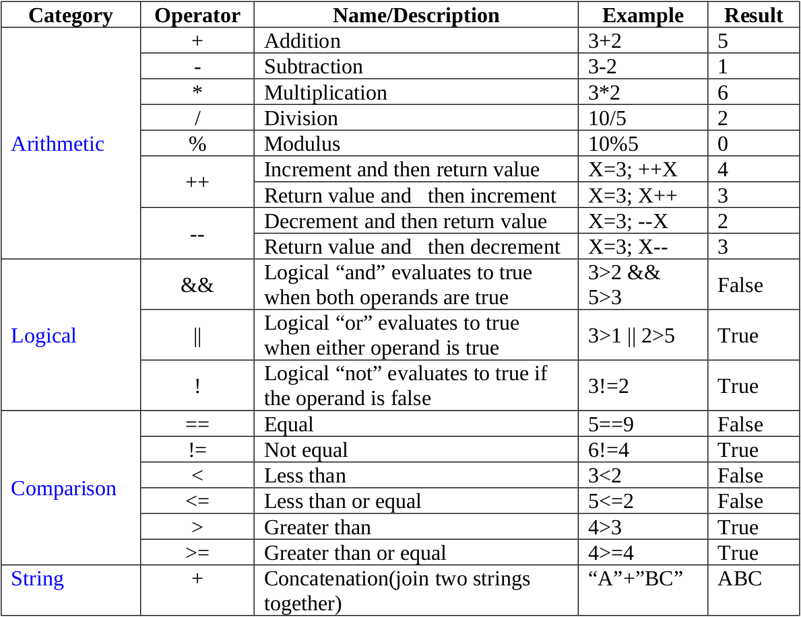

# Data Types in JS
1) In any programming language there are Primitive Data Types these are data types that are defined by the language itself. These data types are pre defined by the language since when we manipulate the data the language should know how to interpret the data otherwise how will it know what opeartions can be performed on what data. In JS there are currently 7 primitive data types.
      1) string
   
      ```javascript
      let stringDT = "string123@$% hello"; // set of alphapnumeric characters
      ```
      2) number
   
      ```javascript
      let numberDT = 123; // set of integers
      ```

      3) boolean

      ```javascript
      // either true or false
      let booleanDTTrue = true;
      let booleanDTFalse = false;

      ```
      4) null

      ```javascript
      // used as a placeholder to specify that a variable is not assigned a value but will be assigned in future
      let nullDT = null; 
      ```
      5) undefined
   
      ```javascript
      var undefinedDT; // initialised as undefined 
      ```
      6) Symbol
   
      ```javascript
      let symbolDT = Symbol("cat") // you can pass anything it just to make a unique copy of something
      ```
      7) big int

      ```javascript
      let bigIntDT = 123n; //initialised by appending a n on the integer used in big calculations
      ```

2) You can check the type of object with the typeof operator.

# Operations on Data Types 
There are various operations that you can perform in JS on various Data Types like on numbers -
   1) Addition
   2) Subtratction
   3) Multiplication
   4) division etc.
   
   On strings -
   1) String concatination (adding 2 strings with +)

Heres a full list


# Type coercion 
When you perform an operation on data type that is not permitted on that data type, JS converts that data to a data type on which that operation is permitted whenever possible.
eg - 
```javascript
"2" - "2" // 0 here js converts string to number
2 + "2" // "22" string output here js converts number to string and concatinates it
2 == "2" // true here js converts string to number and perform shallow equals
// shallow equals is done using double equals signs (==) this only checks if the value is same irrespective of data type.
// strict equals is done using triple equals signs (===) this checks the value as well as data type.
```

# Non primitive data types 
These are data types that are not primitive in nature. They are user defined which means you will design these data types for your own use using methods expose by JS.


1) Javascript literal (Objects) - In js every non primitive data type is an object even arrays function etc;
Objects in Javascript are key value pairs which give info about the data type and the keys are comma seperated

syntax - 
```javascript
let a ={
   prop1:"value1",
   prop2:23,
   prop3:{new:"object"},
   prop4:[1,2]
}
```

2) Array - Imagine That you want to store 10 data which are related for example list of name. What you can do is create 10 different variables and store it but thats not good it will increase code unredability so there must be a better way.
   
```javascript
let a = ["ram","shubh",...] 
//Now elements in array can be refrenced using positions or order in which its placed and the position start with 0.
console.log(a[0]) // ram
console.log(a[1]) // shubh
```
String is an array too.

3) JS functions - In js To improve code redability and reusability also to improve modularity what we can do is seperate our code depending on utility or function. This will make it easier to read our code and will save tons of lines of code for eg - If we are making a game of stone paper scissor there is a comman thing that we want both the players to do that is to choose between stone paper and scissor so now instead of writing the code for it 2 times what we can do is just make a function of it and whenever we need it just use it. They create their own scope. A function is terminated if it encounters a return statement so instructions after return are not executed.

```javascript
function b(){
   // do something
} 
b()

function name(a){
   console.log(a)
   return;
   console.log("l") // not executed
}
name(23) // call a function a will be assigned 23
```
as we can see we can pass an argument to it too and call it whenever we like how many times we like and statements after return will not be executed

[Lecture Struture](../Struture.md)

[Next Lecture](../Control-strutures-Js/info.md)